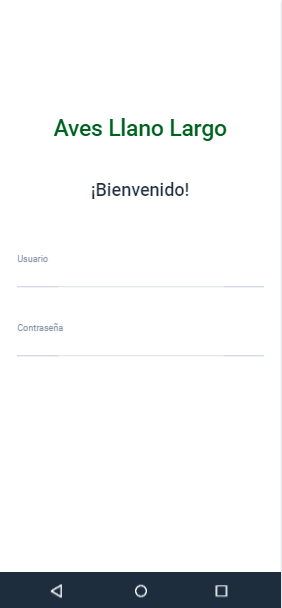
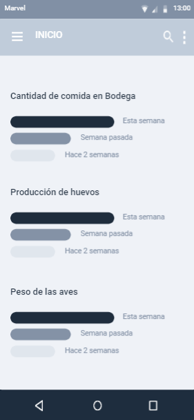
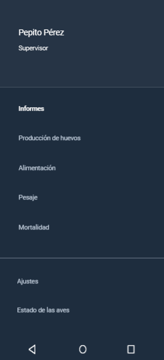
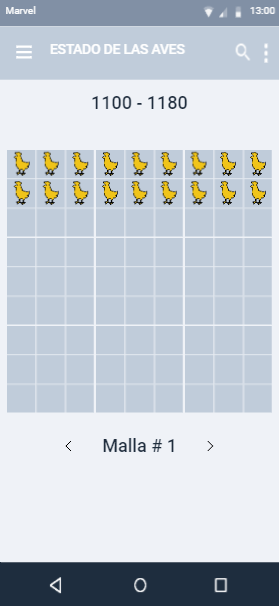
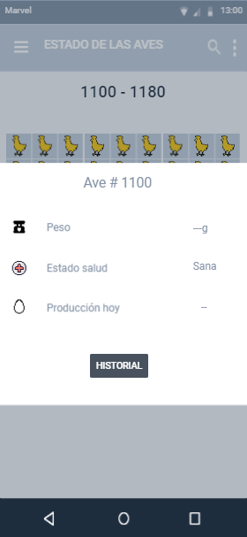

# ***DISEÑO DE INTERFAZ DE USUARIO***
A continuación se presentan los diseños que se tienen actualmente para la interfaz de usuario de la aplicación, teniendo en cuenta la temática y las funcionalidades que tendrá:

## ***INICIO DE SESIÓN***

Preliminarmente se tiene el diseño que se presenta a continuación:

## ***INICIO / HOME***

## ***INFO USUARIO***

## ***ESTADO DE LAS AVES***

## ***DATOS DE UN AVE***
